### 深度学习推荐系统
> 本文笔记为书籍《深度学习推荐系统》整理获得

#### 目录
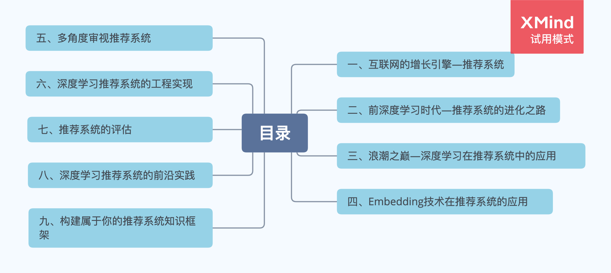

#### 一、互联网的增长引擎——推荐系统
> 目录
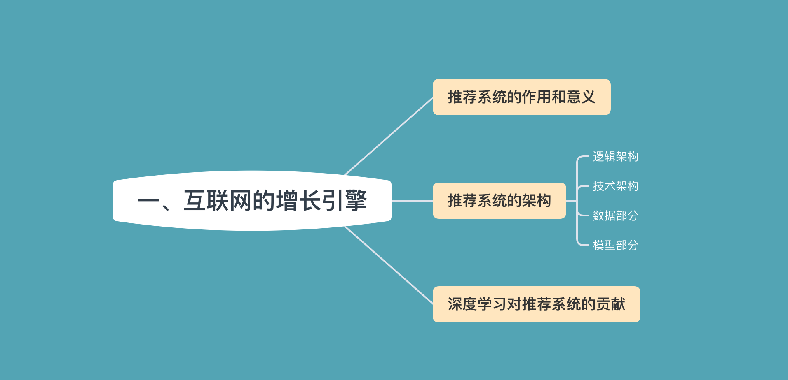
 
##### （一）逻辑架构
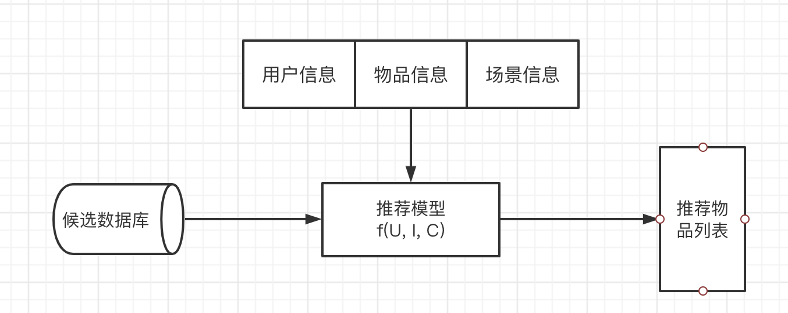

##### （二）技术架构
* 用户信息、物品信息、场景信息：如何存储、更新和处理
> “数据和信息”部分主要内容为数据离线处理、实时流处理

* 推荐系统算法和模型相关的问题：推荐模型如何训练、如何预测、如何达成更好的推荐效果
> “算法和模型”部分主要内容内容为推荐系统中集训练、评估、部署、线上推断

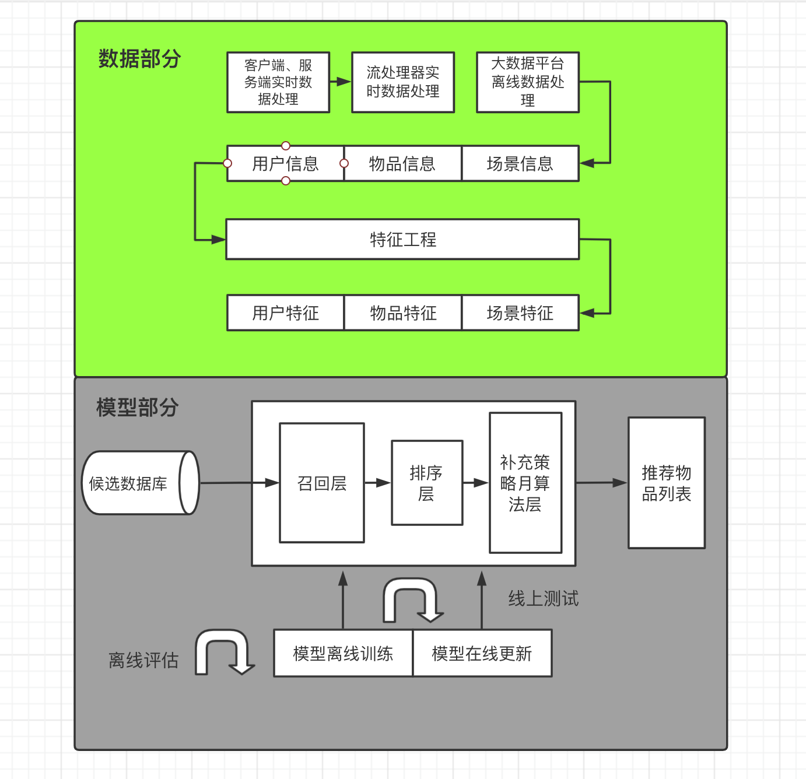

##### （三）数据部分

> 目的一：生成推荐系统所需的**样本数据**，用于算法模型的**训练和评估**

> 目的二：生成推荐模型服务所需的**特征**，用于推荐系统的**线上推荐**

> 目的三：生成系统监控、商业智能系统所需的**统计型数据**

##### （四）模型部分
* 召回层：利用高效的召回规则、算法，快速地从海量的候选集中召回用户可能感兴趣的物品
* 排序层：利用排序模型对初筛的候选集进行精排序
> 学术研究的重点和中心是排序层的算法和优化

* 补充策略与算法层/再排层：通过补充的策略和算法对推荐列表进行一定的调整，最终形成用户可见的推荐列表

#### 二、前深度学习时代——推荐系统的进化之路
> 目录
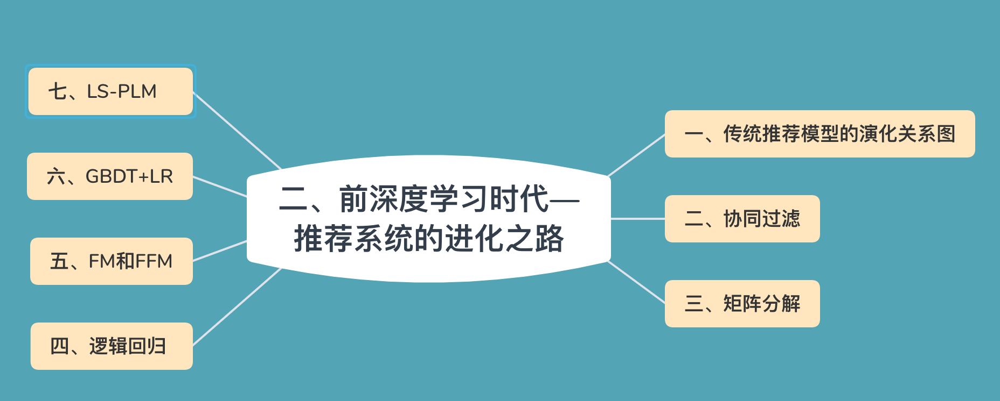

##### （一）传统推荐模型的演化关系
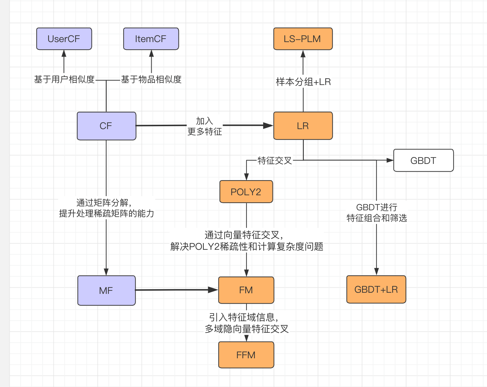

##### （二）协同过滤CF
* UserCF ：基于假设“相似的用户喜欢同一物品”
* ItemCF ：基于假设“同一用户喜欢相似的物品”
* 思路：略
* 优点 ： 直观、高效、经典
* 局限性 ： 空间复杂度高，泛化能力差、推荐结果的头部效应明显，处理稀疏向量的能力弱
* 经典论文：[Amazon](https://blog.csdn.net/qq_24831889/article/details/86147968)

##### （三）矩阵分解MF
* 矩阵分解是协同过滤算方法的进阶，用于解决数据稀疏，并提升泛化能力
* 具体做法是将共现矩阵拆分为用户向量和物品向量，设置损失函数（加入正则化，避免过拟合）
* 通过求得目标函数的最优解，一般使用梯度下降法求得损失函数最小的向量表示
* 将训练后得到的用户向量和物品向量，计算得到不同用户对不同物品的“评价”，作为推荐的依据
* 优点：泛化能力强，空间复杂度低，更好的扩展性和灵活性
* 局限性：依赖用户的历史行为，不方便利用用户、物品和上下文相关的特征
* 经典论文：略
* 代码实例1：[矩阵分解实现](../../../6.【学习进展】蔡升豪学习情况/3.项目实战/基于矩阵分解实现.ipynb)
* 代码实例2：[矩阵分解+推荐系统](../../../6.【学习进展】蔡升豪学习情况/3.项目实战/基于矩阵分解的推荐系统.ipynb)

##### （四）逻辑回归LR
* 融合利用更多特征，用于弥补CF、MF的不足
* 逻辑回归的推荐流程
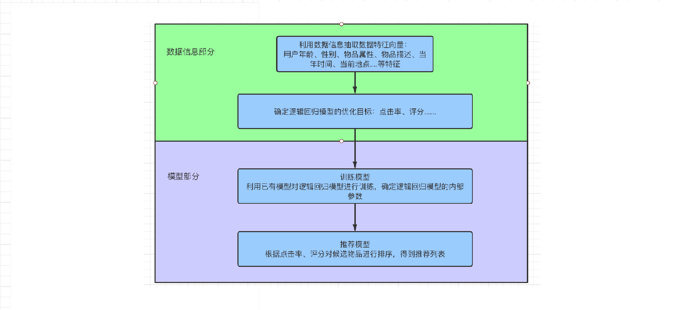
* 模型的推断步骤
> 1. 将特征向量X = (x1,x2....,xn).T作为模型的输入
> 2. 设置权重(w1, w2, ...., wn+1)来表示各个特征的权重，通过X*W将各个特征加权求和
> 3. 将X.T*W 输入sigmoid函数，并映射至0-1，得到“点击率”，或映射至指定区间，得到评分
> 4. 依据现实意义，将用户的点击作为一个二分类的问题，从而确定目标函数
> 4. 通过梯度下降法、牛顿法、拟牛顿法等训练方法，得到最优参数，完成模型的构建

* 优点
> 将用户是否对推荐商品进行点击作为一个二分类问题
> 可解释性强，根据模型得到的权重信息可以确定特征的重要性
> 模型训练开销小

* 局限性
> 特征表达能力差，无法进行特征交叉、特征筛选
> LR的实现可以被更复杂的神经网络覆盖

##### （五）POLY2FM和FFM
* 对逻辑回归模型的改造：使用特征交叉，解决利用单一特征时可能出现的“辛普森悖论”
* 特征交叉的方法
|特征交叉方式|具体方法|简介|
|--|--|--|
|POLY2模型|对所有特征两两交叉|“暴力交叉”，导致更加稀疏，权重参数从n变为n * n,训练的复杂度提升|
|FM模型|隐向量特征交叉|更好地解决数据稀疏性的问题，权重参数数量集减少到n*k，降低了训练开销
|FFM模型|使用特征域进行特征交叉|模型的表达能力更强，计算的复杂度达到kn*n|

###### 1. POLY2
* 目标函数数学形式
$$ \varnothing POLY2 (w,x) = \sum_{j1=1}^{n-1}\sum_{j2=j1+1}^{n} W_{h}(j_{1},j{2})X_{j_{1}} X_{j_{2}}$$
* 公式解读
> 对于所有的特征都进行了两两交叉(特征xj1和xj2)，并对所有的特征组合赋予了权重wh(j1,j2)。

* 具体分析
>1. POLY2通过全面组合特征的方式，在一定程度上解决了特征组合的问题
>2. POLY2模型本质上仍是线性模型，其训练方法与逻辑回归LR并无区别，因此便于工程商的兼容。
>3. POLY2采用了极其暴力的方式将所有特征进行了两两的交叉，这就造成了极大的数据稀疏性问题
>4. POLY2的权重参数变为n的平方

###### 2. FM：引入因子分解
* 目标函数数学形式
$$ \varnothing FM (w,x) = \sum_{j1=1}^{n-1}\sum_{j2=j1+1}^{n} (W_{j_{1}}\cdot W_{j_{2}}) x_{j_{1}}x_{j_{2}} $$
* 具体做法
> 不使用wh(j1,j2)，使用两个向量的内积用于权重系数；
> 为每个特征学习了一个隐权重向量；
> 即在特征交叉的过程中使用这学习到的两个特征的隐向量的内积来作为特征交叉计算的权重。

* 具体分析
>1. 针对POLY2严重的数据稀疏问题，降低特征权重的学习难度；
>2. 权重参数数量减少到了nk，降低了训练开销；
>3. 泛化能力更强，以下文为例：
在某推荐场景下，样本有两个特征分别是A和B，某训练样本的组合是（A1,B1）。
若使用POLY2模型进行训练，那么只有当（A1,B1）组合确实地出现时才能够学习到这个组合对应的权重。
若使用FM模型进行训练但是，A1的相关隐向量更新可以通过（A1,B2）的组合来进行，B1的隐向量也可以通过（A3,B1）来更新，这大幅度的降低了模型对于数据稀疏性的要求。而且，同时也解决了如果出现（A3，B2）这一对从未出现过的特征组合时，通过刚才的学习，模型已经学习过了A3和B2的隐向量，具备了计算该组合特征权重的能力，这是POLY2无法实现的。

###### 3. FFM
* 目标函数数学形式
$$ \varnothing FFM (w,x) = \sum_{j1=1}^{n-1}\sum_{j2=j1+1}^{n} (W_{j_{1},f_{2}}\cdot W_{j_{2},f_{1}}) x_{j_{1}}x_{j_{2}} $$
* 具体做法
> 引入特征域，在FM的基础上用一组隐向量而不是一个隐向量表示；
> 为每个特征学习了一组隐权重向量；
> 在特征交叉的过程中使用两个特征(一般为二个特征交叉)各自对应的隐向量内积作为计算的权重。

* 具体分析
>1. FFM将特征所对应的隐向量的个数进行了提高，由原来的一对一，变成了一对多；
>2. FFM权重参数数量为n* k *f，训练开销为n* n * k；
>3. 比较FM和FFM：
如果使用FM，那么A1,B1和C1都有对应的隐向量wA1,wB1,wC1，那么A1和B1特征、A1和C1做特征交叉的权重应该为wA1·wB1与wA1·wC1，其中，A1对应的隐向量wA1在两次特征交叉的过程中是相同的。
而在FFM的过程中就不同了A1与B1、A1与C1交叉运算时的特殊权重分别为wA1,B·wB1,A和wA1,C·wC1,A。可以看到在面对B1和C1时，A1使用了不同的特征与对应的隐向量与之计算内积来实现对应特征域上的特征交叉。
在FFM的训练过程中，需要学习n个特征在f个域上的k维隐向量，所以相比于FM来说的话复杂度是要高不少的，参数个数维n*k*f个（其中k为隐向量的维度）。在训练方面，FFM的二次项并不能像FM那样简化，因此其复杂度为k*n²。

###### 4. POLY2到FFM的变化和理解

##### （六）GBDT+LR：FaceBook的选择
* FFM模型在处理二项特征交叉较为合适，在使用超过二项特征时，会出现参数爆炸和复杂度过高的问题；
* 高维特征交叉的选择，使用GBDT和LR组合；
> GBDT(Gradient Boosting Decision Tree)（梯度提升决策树）
> LR(Logistic Regression, LR)(逻辑回归)

* 基本思想
> 1. 使用GBDT构建特征工程，即对输入特征进行转换，构造新的特征向量
> 2. 使用LR对转换后的特征进行训练分类
> 3. 一般用于解决“用户点击”这一分类问题

* 具体分析
> 1. GBDT用于特征的重新构造，其他模型例如RF、XBoost也可用于特征的构造
> 2. GBDT和LR组合模型的提出，意味着特征工程模型化的趋势，即解决了：
>> (1) 避免进行人工和半人工额特征组合和特征选择
>> (2) 避免通过改造目标函数这一方式（对模型设计能力的要求较高）
> 3. GBDT+LR组合模型的提出，意味着特征工程可以完全交由一个独立的模型来完成
> 4. GBDT+LR组合模型的提出，意味着端到端训练的可能，不必在特征工程投入过多的人工筛选和模型设计的精力

##### （七）LS-PLM：阿里曾经的推荐系统选择
* 论文链接：[Learning Piece-wise Linear Models from Large Scale Data for Ad Click Prediction](https://arxiv.org/abs/1704.05194)

* LS-PLM，又称MLR(Mixed Logistic Regression,混合逻辑回归)
* 基本思想
> 1. 对样本进行“分片”
> 2. 在每个“分片”内部构建逻辑回归模型
> 3. 将每个样本的各“分片”概率与逻辑回归的得分进行加权平均，得到最终的预估值

* 具体分析: 详见[LS-PLM](https://blog.csdn.net/tinkle181129/article/details/79790341)

##### 总结

|模型名称|基本原理|特点|局限性|  
|--|--|--|--|  
||||  
|矩阵分解|将协同过滤算法中的共现矩阵分解为用户矩阵和物品矩阵，利用用户隐向量和物品隐向量的内积进行排序并推荐|相较于协同过滤，泛化能力有所加强，对稀疏矩阵的处理能力有所加强|除了用户历史行为数据，难以利用其它用户、物品特征及上下文特征|
|逻辑回归|将推荐问题转换成类似CTR预估的二分类问题，将用户、物品、上下文等不同特征转换成特征向量，输入逻辑回归模型得到CTR进行排序并推荐|能够融合多种类型的不同特征| 模型不具备特征组合的能力，表达能力较差|
|FM|在逻辑回归的基础上，在模型中加入二阶特征交叉部分，为每一维特征训练得到相应特征隐向量，通过隐向量间的内积运算得到交叉特征权重|相比逻辑回归，具备了二阶特征交叉能力，模型的表达能力增强|由于组合爆炸问题的限制，模型不易扩展到三阶特征交叉阶段|
|FFM|在FM模型的基础上，加入“特征域”的概念，使每个特征在不同域的特征交叉时采用不同的隐向量|相比FM,进一步加强了特征交叉的能力|模型的训练开销达到了O(n* n)的量级，开销较大|
|GBDT+LR|利用GBDT进行“自动化”的特征组合，将原始特征向量转换成离散型特征向量，并输入逻辑回归模型，进行最终的CTR预估|特征工程模型化，使模型具备了更高阶特征组合的能力|GBDT无法进行完全并行的训练，更新所需的训练时长较长|
|LS-PLM|首先对样本进行“分片”，在每个分片内部构件逻辑回归模型，将每个样本的各分片概率与逻辑回归的得分进行加权平均，得到最终的预估值|模型结构类似三层神经网络，具备了较强的表达能力|模型结构相比深度学习模型仍比较简单，有进一步提高的空间|

#### 三、浪潮之巅——深度学习在推荐系统中的应用
> 目录
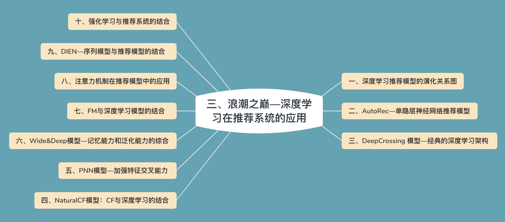

##### 理解深度学习和推荐系统的结合方式
* MLP + 构建神经网络 = AutoRec，DeepCrossing
* MLP + 改变特征交叉方式 = NeuralCF，PNN
* MLP + 注意力机制 = DIN，DIN + 序列模型 = DIEN
* MLP + 强化学习 = DRN
* MLP + 模型组合 = Wide&Deep
* Wide&Deep 专题

##### （一）深度学习推荐模型的演化关系图

##### （二）AutoRec——单隐层神经网络推荐模型
* 推荐系统+神经网络
* [论文出处](https://www.researchgate.net/publication/311491420_AutoRec_Autoencoders_Meet_Collaborative_Filtering)

* 基本思想
> 将自编码器（AutoEncoder）的思想和协同过滤结合，是具有单隐层神经网络模型

* 基本原理
> 1. 利用协同过滤中的共现矩阵
> 2. 完成物品向量/用户向量的自编码
> 3. 利用自编码的结果得到用户对物品的预估评分
> 4. 进行推荐排序

* 模型结构  

* 重建函数  
$$ h(r,\theta ) = f(W\cdot g(V_{r}+\mu  ) + b) $$

* 目标函数  
$$ min\sum_{i=1}^{n}\left \| r^{(i)} - h(r^{(i)};\theta ) \right \|^{2} + \frac{\lambda }{2}\cdot (\left \| W \right \|^{2} + \left \| V \right \|^{2}) $$

* 训练过程
> 1. 构建三层神经网络模型，输入为物品/用户的原始评分向量
> 2. 根据目标函数，通过反向传播算法更新参数矩阵W和V
> 3. 完成模型的训练

* 推荐过程
> 1. 将物品/用户的评分矩阵输入训练好的重建函数，得到所有物品/用户的评分预测矩阵
> 2. 比那里评分预测矩阵，排序获得推荐列表

* 模型评价
> 1. 使用了神经网络的基本结构，具有一定的泛化和表达能力
> 2. 模型结构简单，表达能力不足

##### （三）DeepCrossing模型：微软的选择，2016
* 论文解读
[Web-Scale Modeling without Manually Crafted Combinatorial Features](https://blog.csdn.net/qq_40860934/article/details/110451599)

* 基本思想：Embedding + 多层神经网络

* 模型结构  
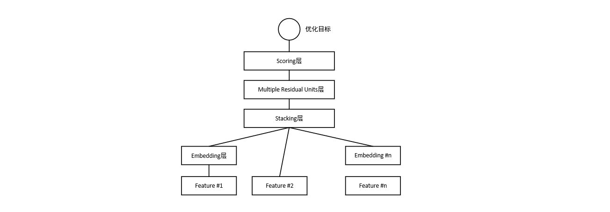
> 由下往上观察

> 1. Endedding层：将特征转换为稠密的向量，常用Word2vec,GraphEmbedding，数值型特征不用Embedding  
> 2. Stacking层：将不同的Embedding特征和数值型特征拼接在一起
> 3. MutipleResidualUnits层：多层残差组合，使用多层残差网络实现多层感知机，组成神经网络，利用BP反向传播训练
> 4. Scoring层：输出层，用于你和优化目标，针对二分类使用逻辑回归模型，针对多分类使用softmax模型

* 具体分析
> 1. DeepCrossing模型没有使用任何人工处理特征
> 2. DeepCrossing模型将特征交叉的任务完全交给模型
> 3. DeepCrossing模型通过调整神经网络的深度进行特征之间的“深度交叉”

##### （四）NeuralCF模型：新加坡国立大学，2017
* 论文解读
[Neural Collaborative Filtering](https://zhuanlan.zhihu.com/p/131274333)

* 基本思想：神经网络Neural + 协同过滤CF
> 1. 完成端到端的推荐工作，包括：特征工程、稀疏向量稠密化、多层神经网络优化
> 2. 对类别特征、数值特征、其他特征进行Embedding、拼接，并使用残差神经网络对特征进行交叉组合
> 3. 设定优化目标函数

* 模型结构  

* 将CF中用户向量和物品向量的简单内积运算替换成了“多层神经网络+输出层”：用户向量和物品向量更充分的交叉、引入更多的非线性特征，增强表达能力
* 输入用户隐向量和物品隐向量后，通过神经网络模型，求得“相似度”，作为评分的预测

* 模型的扩展

> 1. 理解“广义矩阵分解”模型
> 2. 可通过"元素积"替代内积进行互操作：使用神经网络/GMF等操作方式
> 3. 可将不同的互操作网络得到的特征向量拼接起来，并通过输出层进行拟合
> 如下图所示：

* 具体分析
> 1. 优势：结合神经网络，可利用神经网络的优势：能够拟合任何函数，灵活组合不同特征，按需控制复杂度
> 2. 局限性：协同过滤本身的局限性(无法利用更多特征)，神经网络的局限性(更大的训练开销和过拟合的风险)

##### （五）Wide&Deep模型——记忆能力和泛化能力的综合：Google，2016
* 泛化能力和记忆能力
> 泛化能力：发掘稀疏特征、局部特征和最终结果、全局特征的相关性的能力  
> 记忆能力：直接利用特征、利用历史信息的能力
> 传统的简单模型一般具有较好的记忆能力

* 论文出处
[论文链接](https://github.com/talentlei/PaperList)

* 基本形式
> 1. 设置Wide部分和Deep部分，结合二者的记忆能力和泛化能力
> 2. Wide部分处理稀疏的特征，例如id类特征
> 3. Deep部分处理全部特征，试图找出藏在特征背后的数据模式
> 4. 利用逻辑回归模型（LR），将Wide部分和Deep部分结合起来，组成统一的模型

* 具体做法（以Googe Play为例）
* Google Play的推荐任务属于CTR，即通过推荐使用户点击下载应用

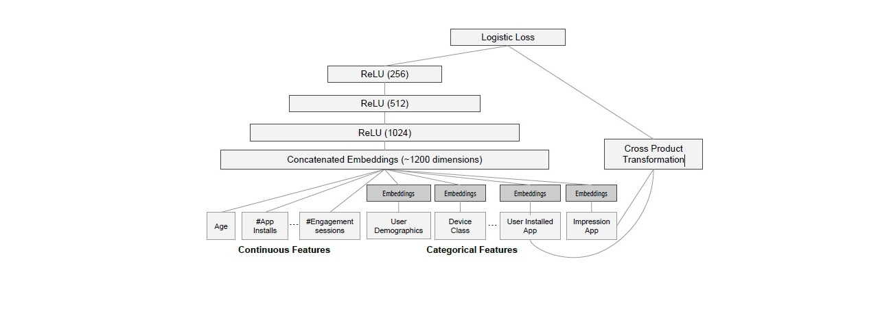

> 1. 使用的特征：数值型特征 + 类别型特征
> 2. Deep部分使用特征：利用用户年龄、已安装应用数量、参与会话数量等数值型特征作为神经网络模型的输入，将用户人口属性特征、设备类型、已安装应用、曝光应用通过Embedding层向量化后输入神经网络模型
> 3. Wide部分使用特征：直接使用已安装应用、曝光应用等特征（可以直接影响是否点击下载当前应用）
> 4. Deep神经网络部分：拼接向量化后的特征（1200维），经过三层Relu全连接层输入Logistic Loss层
> 5. Wide部分：交叉积变换函数
> 6. logistic loss输出层部分：接收Wide部分和Deep部分的输出，并完成拟合

* 具体分析

> 1. 优势：结合神经网络，可利用神经网络的优势：能够拟合任何函数，灵活组合不同特征，按需控制复杂度
> 2. 局限性：协同过滤本身的局限性(无法利用更多特征)，神经网络的局限性(更大的训练开销和过拟合的风险)

##### （六）Wide&Deep模型的进化——Deep&Cross模型（DCN）：Google、斯坦福大学，2017
* 对Wide&Deep做出的改进：在模型结构上将Wide部分使用Cross网络进行替代

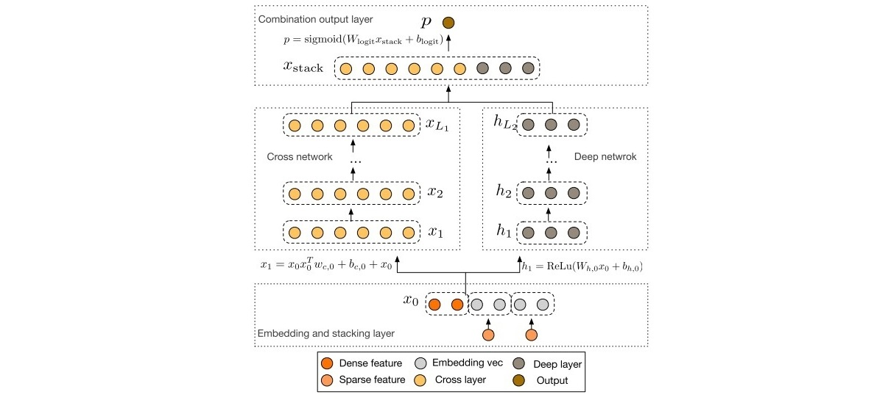

* Embedding 层  
$$ x_{0} = [x_{1},x_{2},x_{3},...,x_{d}] $$
> 理解：Embedding层的输出可以是稠密特征+向量化后的稀疏特征

* Wide：Cross Network 交叉网络层  

$$x_{l+1} = x_{0} x_{l}^{T} + b_{l} + x_{l}$$
> 理解：第l+1层的特征交叉向量xl = 初始向量x0 * 第l层特征交叉向量 * 权重W + 偏置向量 + 第l层特征交叉向量xl  
> 添加了原输入向量xl、权重wl、偏置向量bl

* Deep：DNN 全连接层
$$ h_{l+1} = f( W_{l}h_{l}+b_{l} ) $$

* Combination ouput layer 合并输出层  
$$ p = sigmoid(W_{logit}X_{stack} + b_{logit}) $$

(七) FM和深度学习模型的结合